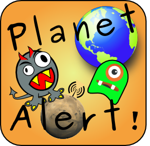

This is the complete documentation [Planet Alert](http://planetalert.tuxfamily.org).

To find information in this documentation, you may uise the above 'Zoom' icon. 

For a quick access to subtitles when you are reading long pages, feel free to hover on the Anchor icon in the top right-hand corner. You would then have a direct access to subtitles.

---
[Work in progress]

This documentation is not really up to date yet. The [French version](https://celfred.gitbooks.io/planet-alert-documentation/content/fr/) is a lot more accurate.
