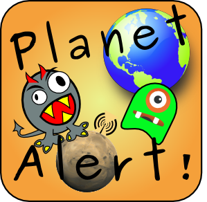

Documentation de [Planet Alert](http://planetalert.tuxfamily.org).

Pour trouver une information précise dans cette documentation, vous pouvez utiliser le champs de recherche en haut à gauche.

Pour accéder plus rapidement aux sous-titres lorsque vous ocnsultez des pages un peu longues, n'hésitez pas à survoler l'ancre qui se trouve en haut à droite et se dérouleront alors tous les sous-titres possibles.

---
Cette documentation n'est pas forcément à jour mais permettra de connaître les fonctions les plus importantes de Planet Alert et de se faire une idée de l'objectif de ce 'jeu'. Pour plus de détails, vous pouvez consulter le [CHANGELOG](https://framagit.org/celfred/planetAlert/blob/master/CHANGELOG.md) sur Framagit (en anglais).

