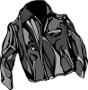
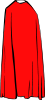

# L'équipment

L'équipement possible pour votre avatar est classé dans différentes catégories. Attention, tous les équipements ne sont pas accessibles selon le niveau de votre joueur! Pour connaître le détail précis de chaque équipement, il faut aller directement voir [The Shop](http://planetalert.tuxfamily.org/shop/) (Le Magasin).

## The Weapons (Les Armes)

Les armes permettent de gagner davantage d'XP et de GC lors d'actions positives.
Pour le moment, les armes disponibles sont :

| Image | Name | Description |
|:--------:|:--------:|:--------:| 
|  | Sword | l'Épée.
|  | Bow | l'Arc.
|  | Axe | la Hache.
|  | Laser Gun | Le Pistolet Laser.
|  | Golden Sword | l'Épée d'Or.

## The Protections (Les Protections)

Les protections permettent de perdre un peu moins d'HP lors d'actions négatives.
Pour le moment, les protections disponibles sont :

| Image | Name | Description |
|:--------:|:--------:|:--------:| 
|  | Leather Jacket | La Veste en Cuir. |
|  | Magic Cape | La Cape Magique. |
|  | Simple Shield | Le Simple Bouclier |
|  | Iron Shield | Le Bouclier Renforcé |
|  | Anti-X-Ray Glasses | Les Lunettes Anti-Rayons-X |
|  | Iron Armor | L'Armure Renforcée |
|  | Golden Shield | Le Bouclier d'Or |

## The Potions (Les Potions)

Les potions ont un usage ponctuel spécifique :

| Image | Name | Description |
|:--------:|:--------:|:--------:| 
|  | Efficiency Potion (Potion de Sur-efficacité) | Cette potion permet de ne pas faire son entraînement régulier sans toutefois perdre ni HP, ni GC.
|  | Hacking Potion (Potion de Hacking Informatique) | Cette potion permet de travailler sur l'ordinateur pendant 1 heure de cours.
|  | Healing Potion (Potion de Soin) | Cette potion permet de regagner des HP (+8 points).
|  | Resting Potion (Potion de Repos) | Cette potion permet de passer une heure de cours sans participer tout en obtenant une 'Good Communication' ;) 
|  | Teaching Potion (Potion d'Enseignement) | Cette potion permet d'assister le professeur pendant 1 heure de cours.
|  | Teleportation Potion (Potion de Téléportation) | Cette potion permet de choisir sa place en classe durant 1 heure de cours.

## Les items de groupe

Les items de groupe sont disponibles pour _tous_ les membres d'un groupe si _1_ membre l'a acheté au magasin.
Pour le moment, un seul item de groupe est disponible :

| Image | Name | Description |
|: -------- :|: -------- :|: -------- :| 
|  | Memory Helmet - Le Casque Memoriel | Ce casque permet de gagner des points de UT.
