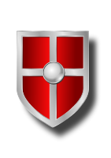

# L'équipment

L'équipement possible pour votre avatar est classé dans différentes catégories. Attention, tous les équipements ne sont pas accessibles selon le niveau de votre joueur! Pour connaître le détail précis de chaque équipement, il faut aller directement voir [The Shop](https://planetalert.tuxfamily.org/shop/) (Le Magasin).

## The Weapons (Les Armes)

Les armes permettent de gagner davantage d'XP et de GC lors d'actions positives.
En voici quelques une :

| Image | Name | Description |
|:--------:|:--------:|:--------:| 
|  | Sword | l'Épée.
|  | Bow | l'Arc.
|  | Axe | la Hache.
|  | Laser Gun | Le Pistolet Laser.
|  | Golden Sword | l'Épée d'Or.

Mais il y en a d'autres : le trident, le fusil automatique, la batte de baseball, la hâche doudle...

Si un joueur possède plusieurs armes, les 2 armes les plus fortes seront prises en compte dans les calculs.

## The Protections (Les Protections)

Les protections permettent de perdre un peu moins d'HP lors d'actions négatives.
En voici quelques une :

| Image | Name | Description |
|:--------:|:--------:|:--------:| 
|  | Leather Jacket | La Veste en Cuir. |
|  | Magic Cape | La Cape Magique. |
|  | Simple Shield | Le Simple Bouclier |
|  | Iron Shield | Le Bouclier Renforcé |
|  | Anti-X-Ray Glasses | Les Lunettes Anti-Rayons-X |
|  | Iron Armor | L'Armure Renforcée |
|  | Golden Shield | Le Bouclier d'Or |

Mais il y en a d'autres : le masque ç gaz, le bouclier royal, le casque simple...

Si un joueur possède plusieurs armes, la plus forte sera prise en compte dans les calculs.

## The Potions (Les Potions)

Les potions ont un usage ponctuel spécifique :

| Image | Name | Description |
|:--------:|:--------:|:--------:| 
|  | Efficiency Potion (Potion de Sur-efficacité) | Cette potion permet de ne pas faire son entraînement régulier sans toutefois perdre ni HP, ni GC.
|  | Hacking Potion (Potion de Hacking Informatique) | Cette potion permet de travailler sur l'ordinateur pendant 1 heure de cours.
|  | Healing Potion (Potion de Soin) | Cette potion permet de regagner des HP (+8 points).
|  | Resting Potion (Potion de Repos) | Cette potion permet de passer une heure de cours sans participer tout en obtenant une 'Good Communication' ;) 
|  | Teaching Potion (Potion d'Enseignement) | Cette potion permet d'assister le professeur pendant 1 heure de cours.
|  | Teleportation Potion (Potion de Téléportation) | Cette potion permet de choisir sa place en classe durant 1 heure de cours.
|  | Recovering Potion (Potion de Récupération) | Cette potion permet d'augmenter sa capacité de combat à 6 combats par jour (au lieu de 3).
|  | Transformation Potion (Potion de Transformation) | Cette potion permet de changer son avatar (pour le moment, il faut en créer un autre et l'envoyer à l'enseignant·e qui fera la manipulation).
|  | Captain Potion (Potion de Capitaine) | Cette potion permet de devenir Capitaine provisoirement pour 1 activité en classe.
|  | Memory Potion (Potion de Mémoire) | Cette potion donne accès à des missions de mémorisation permettant de gagner des points supplémentaires en les réalisant (courts textes à mémoriser, dictons, proverbes, poèmes...)

## Les items de groupe

Les items de groupe sont disponibles pour _tous_ les membres d'un groupe si _1 seul_ membre l'achète.
Pour le moment, les items de groupe suivants sont disponibles :

| Image | Name | Description |
|: -------- :|: -------- :|: -------- :| 
|  | Memory Helmet - Le Casque de méoire | Ce casque permet d'accéder aux exercices en ligne et de gagner des points de UT.
|  | Book of Knowledge - Le Livre des Savoirs | Le livre donne accès à des leçons. En copiant une leçon, un joueur augmente son XP et gagne des GC.
|  | Electronic Visualizer - Le visualisuer électronique | Ce détecteur permet de voir tous les monstres (exercices) chaque jour. Sans lui, chaque jour, certains monstres se cachent et ne sont donc pas accessibles pour le joueur.
