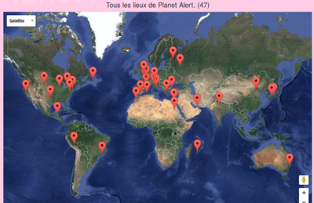
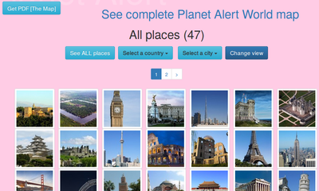
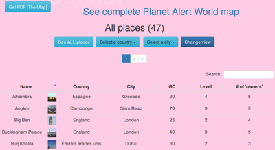

# The Map (La Carte)

La carte offre un aperçu de tous les endroits devant être libérés dans Planet Alert. Attention! Tous les lieux ne sont pas accessibles dès le départ! Certains lieux ne sont accessibles qu'à partir de certains niveaux.

Pour parcourir l'ensemble des lieux, vous pouvez cliquer sur "See complete Planet Alert World map" tout en haut. Vous obtiendrez alors :

Vous pouvez également observer les miniatures avec la vue par défaut :

Vous pouvez encore parcourir la liste détaillée en cliquant sur "Change view" :

Un joueur ne peut pas libérer un lieu depuis cet espace. Pour libérer un lieu, il faut :
- accéder à la Marketplace afin d'effectuer directement la libération. Il faut alors être connecté avec ses identifiants.
- en faire la demande en classe en complétant la fiche à disposition.
- compléter le formulaire de 'Contact' directement sur le site.

Évidemment, le joueur doit disposer de suffisamment de GC et être au niveau requis.
