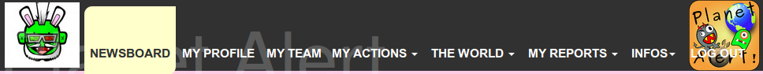

# Le Menu Principal

Le menu en haut de l'écran est l'interface principale pour agir dans Planet Alert.

Quand le joueur est connecté à son espace, son avatar doit s'afficher en haut à gauche. Le menu proposé ressemble alors à l'image suivante : 

Voilà ensuite les différentes options proposées : (Cliquez sur les liens pour lire les informations détaillées)






# The World

Ce menu permet de découvrir le monde complet proposé par Planet Alert. Vous y trouverez tous les lieux, tous les équipements, toutes les actions possibles... En parcourant ces 'catalogues', vous pouvez voir vos prochains objectifs, savoir quel niveau est nécessaire pour débloquer telle ou telle chose...

* [The Shop](equipment.md) : Le Magasin présente tout l'équipement possible.
* [The Map](map.md) : La Carte indique tous les lieux possibles du jeu.
* [The Actions](actions.md) : Les Actions listées ici montrent tout ce qui est pris en compte pour l'évolution de votre personnage.
* [The Monsters](monsters.md) : Les Monstres correspondent aux exercices en ligne réalisables pour augmenter ses points de UT.



# Infos

3 options sont disponibles dnas ce menu : 
- Le lien pour accéder à la documentation (ce que vous êtes en train de lire).
- Le lien vers les archives du Newsboard. Cette page est utlie pour voir les différentes options qui ont été ajoutées dnas Planet Alert au fil du temps.
- Contact : Le formulaire permet de contacter facilement l'administrateur.

# Log out

N'oubliez pas de vous déconnecter quand vous quittez le jeu !
