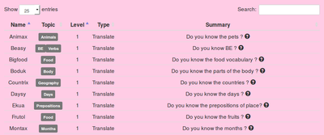

 # The Monsters (Les Monstres)

Cette liste présente l'ensemble des monstres présents dans Planet Alert. Chaque monstre correspond à un exercice en ligne. Ils sont classés par thèmes, par niveaux, et par type.

Les types d'exercices sont :
- Translate : des mots à traduire.
- Quiz : des questions auxquelles il faut répondre.
- Image-map : Une image légendée (avec des numéros, par exemple) et le joueur doit indiquer à quoi correspond la légende
- Categorize : Ranger dans des catégories

Ces exercices évolueront et d'autres types verront le jour peu à peu. Parmi les idées : des exercices de compréhension orale à partir de textes audio ou de vidéos, des exercices avec chronomètres, des exercices avec davantage d'action...

Vous pouvez vous entraîner sur ces monstres (grâce au Memory Helmet) afin de gagner des points de UT. Attention, chaque jour la moitié des monstres se cache et ne sont donc pas accessibles. Pour pouvoir détecter TOUS les monstres, il fat posséder le Electronic visualizer.

Lorsque vous cumulez +20UT sur un monstre, celui-ci peut désormais être combattu. Pour cela, il suffit d'aller dans 'My Actions' et de choisir l'option 'Fight a monster'. Le combat permet d'augmenter son XP, ainsi que son Fighting Power. Durant les combats, le joueur doit combattre en répondant aux questions avant de perdre toute son énergie. Le résultat du combat dépendra de la qualité des réponses et de la vitesse de réponse du joueur.

Si le joueur possède une arme, il sera plus dangereux et augmentera ainsi sa force de frappe: le monstre perdra plus d'energie à chaque coup porté.
Si le joueur possède une protection, il perdra moins d'energie en cas de mauvaise réponse.
Un joueur avec de l'équipement aura donc plus facile à vaincre lors des combats :)

Si un joueur combat 3 fois un même monstre et obtient une moyenne positive, il obtiendra 1 médaille et pourra ensuite consulter son 'tableau de chasse', page indiquant tous les monstres vaincus.

Si un joueur cumule 10 combats, il débloquera l'accès au Fighters Playground, le Terrain de jeu des Combattants.
